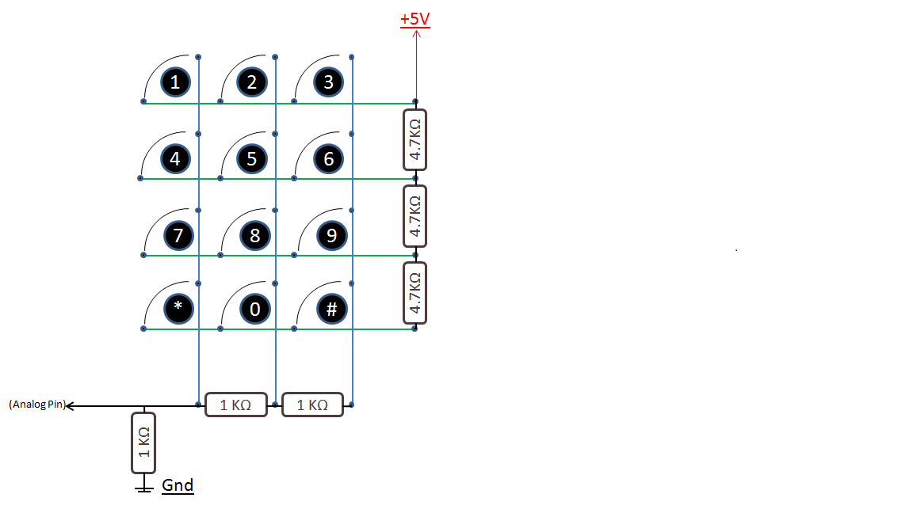
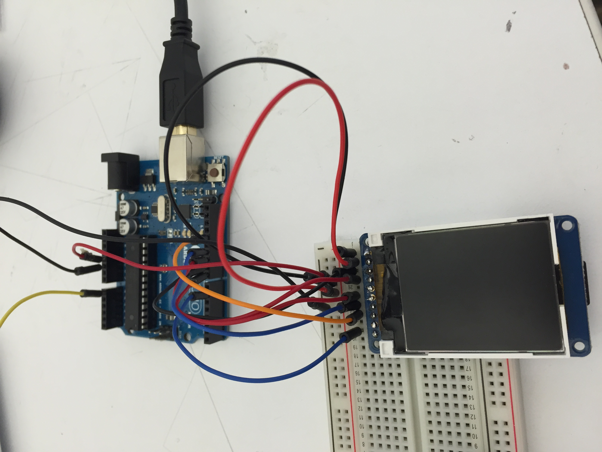
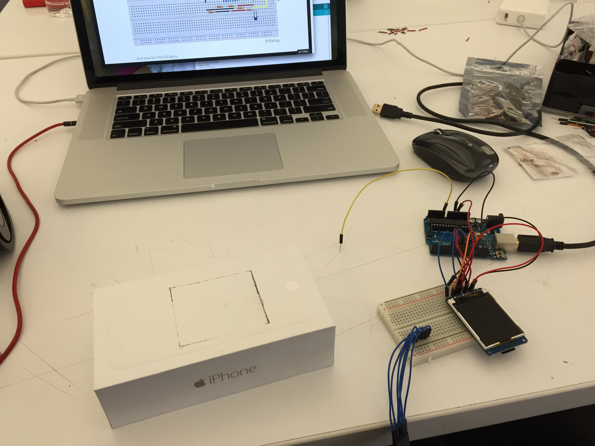
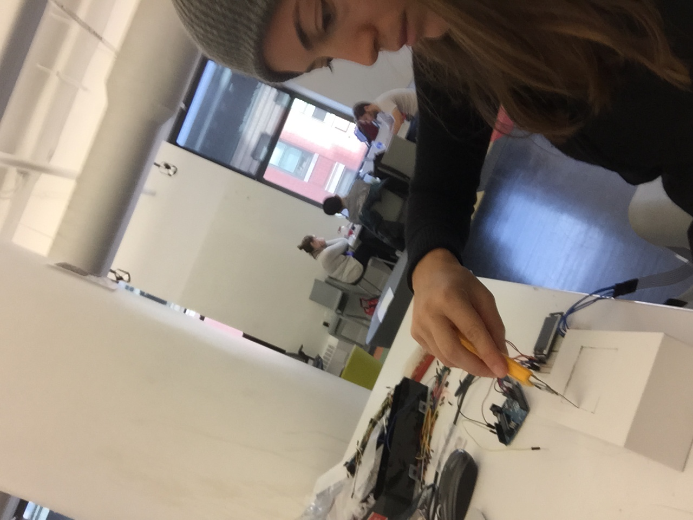
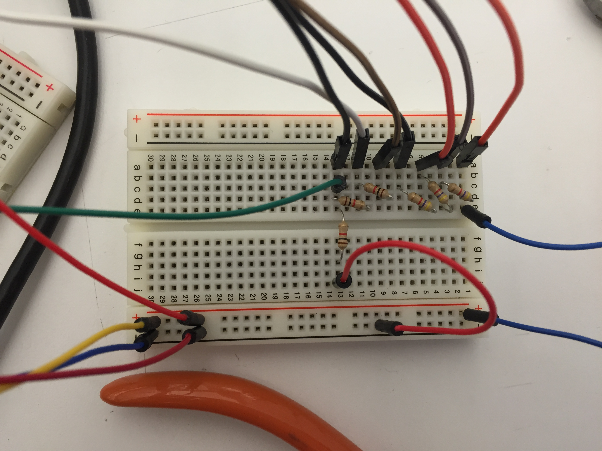
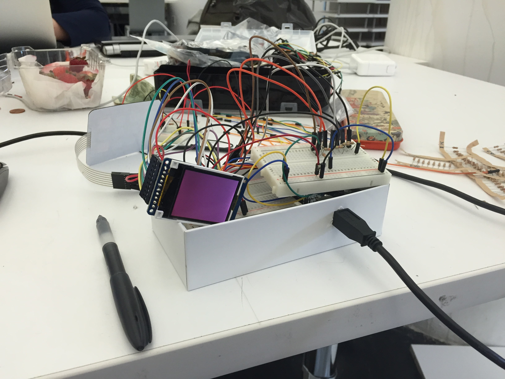
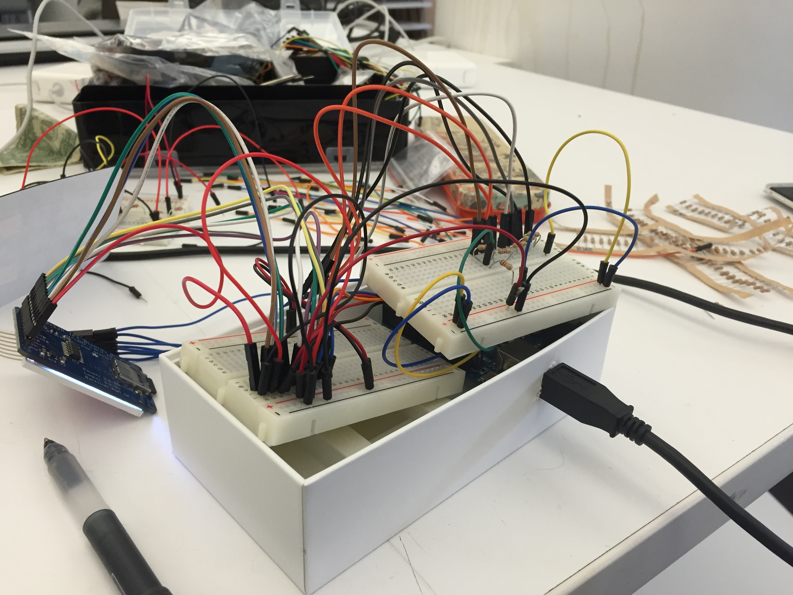
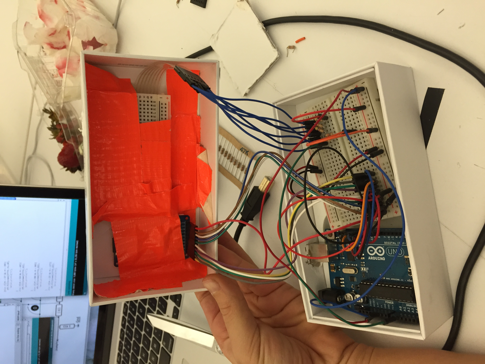
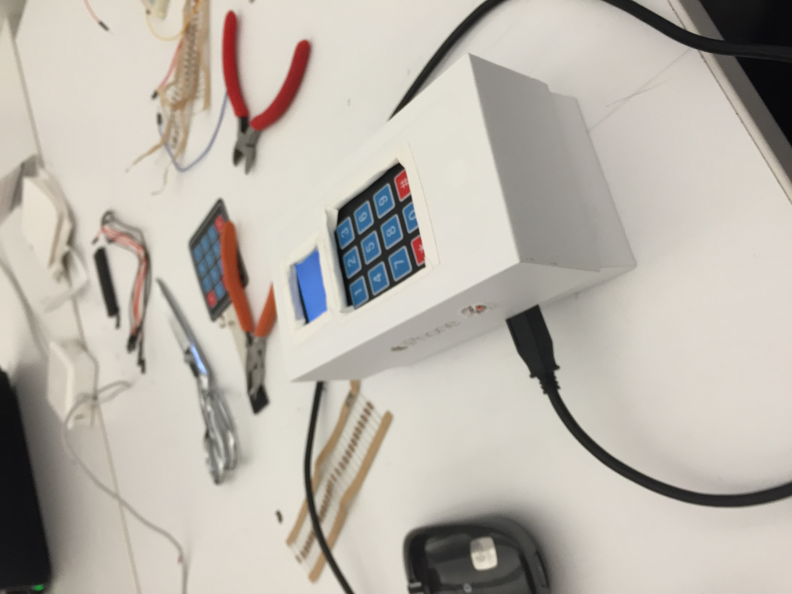

ccLab Arduino Project: Color Box
=================
Here is my Arduino Project. I made a "Color Box" - a box that displays squares of color when the user pushes numbers on the keypad. Each number is associated with a color and the user can push any button and see a rainbow! It is a fun project that is meant to show my understanding of Arduino, inputs, and outputs. 

**Main Components:
**

-Arduino Uno

-TFT 1.8" 

-4x3 Pin Key Pad

-iPhone Box to conceal wires

**Libraries used:
**

Adafruit_GFX.h

Adafruit_ST7735.h

SPI.h

# Presentation

Here is my final presentation:
[Final Presentation](https://vimeo.com/110315429)

Here is a video of me explaining a bit more about the code:
[Explanation](https://vimeo.com/110316498)

Here is a video of the box working - final testing:
[Box Working](https://vimeo.com/110314569)

# Documentation

Here are some images of my process. 

Schematic used to set up key pad:

Wiring the LCD screen:

Working on the box:

Cutting the box:

Wiring the keypad:

Prototyping box with bread-boards:

Assembling the box and components:

Final box ready to go:

